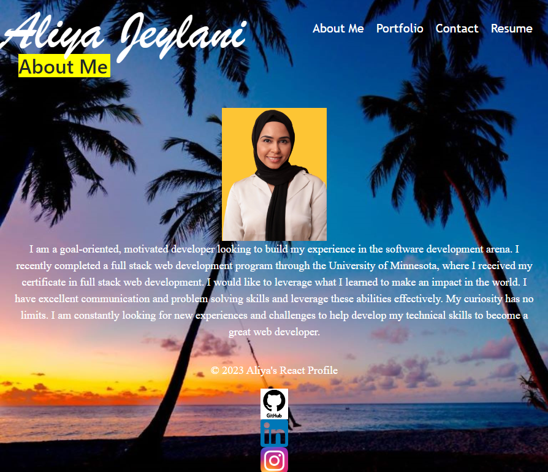

# my_react_portfolio

# Description
  This week's project is to create a react app that allows me to share my project work with fellow developers and collaborate on future projects. 

  Here's the url of my functional, deployed application: https://aliyajeylani.github.io/reactportfolio/

   

  ### Installation
 - Clone my project from github ( git@github.com:aliyajeylani/my_react_portfolio.git)
 - Install dependencies: react, react-bootstrap, react-dom, etc, by using (npm install)
 - Run the project/start our server by using (npm start)

  ### Usage

  Here is the link to my gitHub repository: https://github.com/aliyajeylani/reactportfolio

  ### Credits
  
  N/A

  ### License

  MIT License

 
